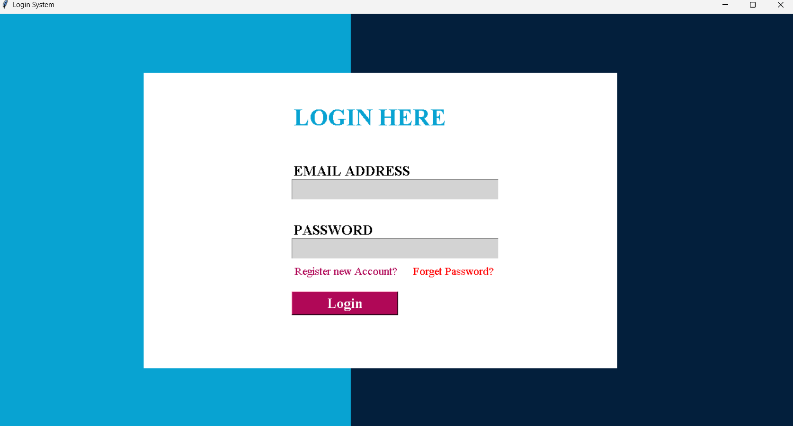
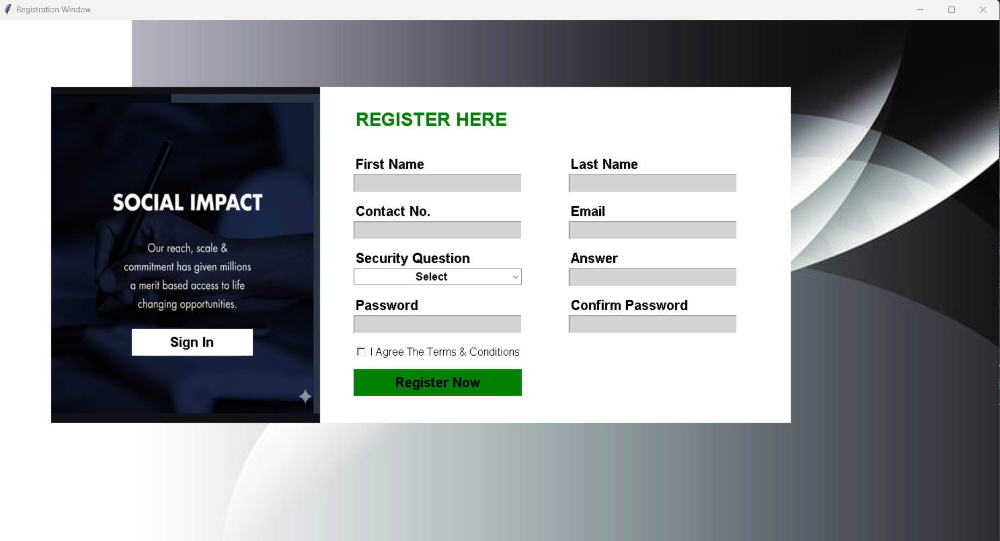

# 🔐 Login & Registration System

A backend-based Login and Registration System built using **Python**, **Tkinter**, and **SQL Server**.  
This project demonstrates user authentication, database integration, and basic backend logic.

## 🚀 Features

- User Registration
- User Login Authentication
- SQL Server Database Integration
- Error Handling
- Clean UI using Tkinter 

## 📷 Output Screenshots

### Login Page

### Registration Page

## Tech Stack
- Python
- Tkinter (GUI)
- SQL Server (SSMS)
- pyodbc

## Setup
1. Install pyodbc
2. Setup database in SSMS
3. Run login.py

## Author
Ranjeet Kannaujiya

## 📂 Project Structure